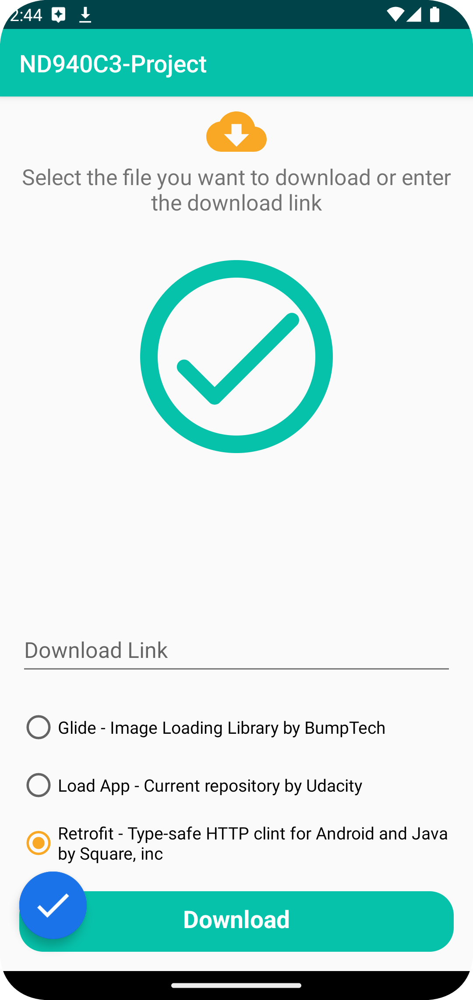
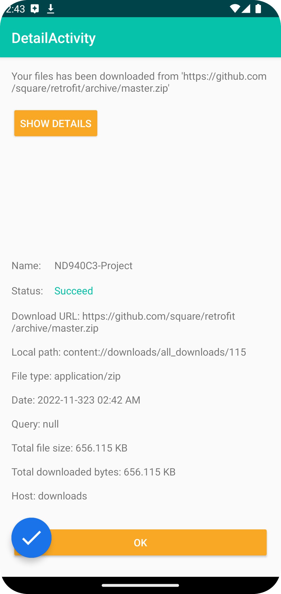
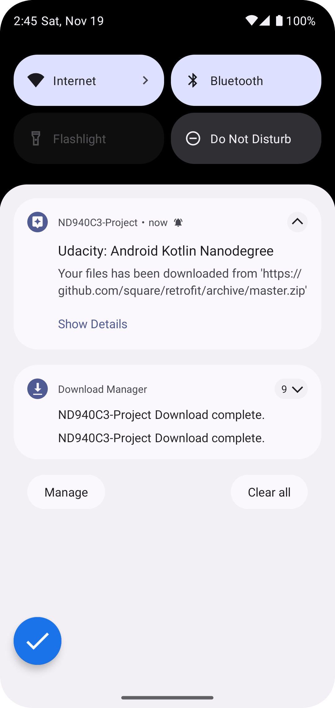
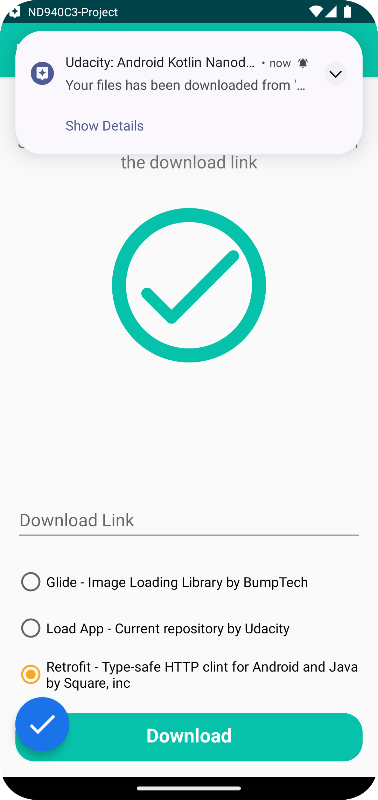

# DownloadApp
### Download Any File/Files you want from the internet and save it in you device

* Download Manager
* Notification API
* Custom Views 
* Animation 
* Motion Layout
* Value Animator 

  
  

  
  

## Getting Started

This project is a starting point for a Android application Development.

A few resources to get you started:

- [Android Documentation](https://developer.android.com/docs)
- [Android DownloadManager](https://developer.android.com/reference/android/app/DownloadManager.html#openDownloadedFile(long))
- [Android MotionLayout](https://developer.android.com/develop/ui/views/animations/motionlayout)
